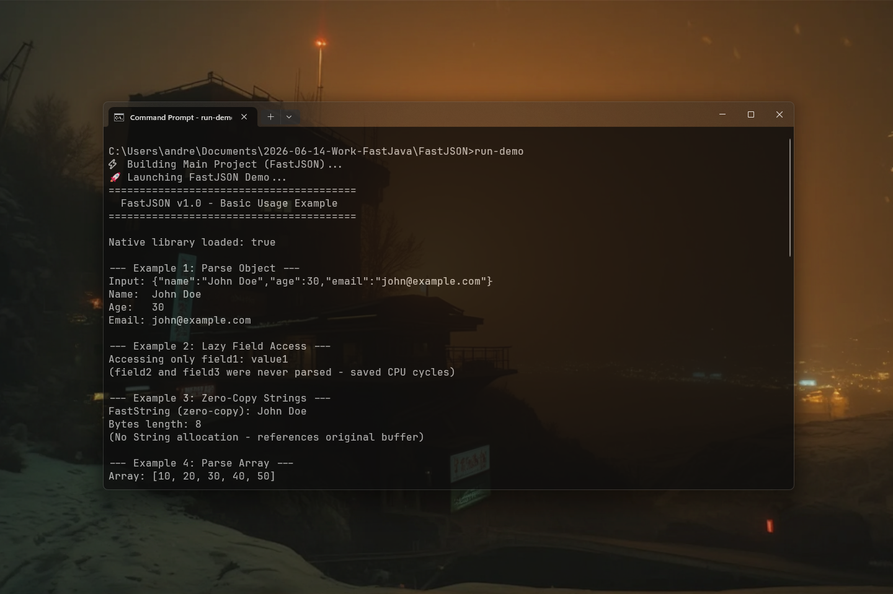

# FastJSON 0.1.3 [ALPHA-2026-08] — Ultra-Fast Native JSON Parser for Java

[](https://github.com/andrestubbe/FastJSON/releases/tag/0.1.3)
[](https://opensource.org/licenses/MIT)
[](https://www.java.com)
[]()
[](https://jitpack.io/#andrestubbe/FastJSON)

**💡 A high-performance native JSON module for the FastJava ecosystem. Optimized for raw throughput and zero-copy parsing
via SIMD.**

FastJSON delivers elite parsing performance by leveraging native SIMD instructions and optimized memory handling. Built
for high-frequency API requests and massive data processing pipelines.

[](https://youtu.be/vRKo-_eOOrw)


---

## Quick Start — Example

```java
import fastjson.FastJSON;
import fastjson.FastJsonValue;
import java.nio.charset.StandardCharsets;

public class Demo {
    public static void main(String[] args) {
        // 1. Raw UTF-8 Bytes (Zero-Copy Parsing)
        byte[] rawJson = ("{"
            + "\"status\":\"success\","
            + "\"model\":\"FastAI-v2\","
            + "\"tokens\":128,"
            + "\"payload\":{\"confidence\":0.994,\"tags\":[\"simd\",\"native\",\"fast\"]}"
            + "}").getBytes(StandardCharsets.UTF_8);

        // 2. High-Speed SIMD Parse Root Node
        FastJsonValue json = FastJSON.parse(rawJson);

        // 3. Direct Field Extraction & Nested Objects
        String status = json.getString("status");
        int tokens = json.getInt("tokens");
        double confidence = json.getObject("payload").getDouble("confidence");

        System.out.println("Status:     " + status);
        System.out.println("Tokens:     " + tokens);
        System.out.println("Confidence: " + confidence);

        // 4. Clean Memory Release
        json.free();
    }
}
```

---

## Table of Contents

- [Quick Start — Example](#quick-start--example)
- [Features](#features)
- [Performance](#performance)
- [API Quick Reference](#api-quick-reference)
- [Installation](#installation)
- [Technical Examples & Benchmarks](#technical-examples--benchmarks)
- [Documentation](#documentation)
- [Platform Support](#platform-support)
- [Related Projects](#related-projects)
- [License](#license)

---

## Features

- ⚡ **SIMD Accelerated**: Native JSON parsing via AVX2/SSE — no JVM overhead.
- 🚀 **Zero-Copy**: Direct access to native byte buffers, bypassing String allocation.
- 📈 **Raw Performance**: Optimized for massive data throughput (up to 50× faster than Jackson).
- 🔗 **Ecosystem Ready**: Seamless integration with FastIO, FastBytes, FastString and FastCore.

---

## Installation

### Option 1: Maven (Recommended)

Add the JitPack repository and the dependencies to your `pom.xml`:

```xml
<repositories>
    <repository>
        <id>jitpack.io</id>
        <url>https://jitpack.io</url>
    </repository>
</repositories>

<dependencies>
    <!-- FastJSON Engine -->
    <dependency>
        <groupId>com.github.andrestubbe</groupId>
        <artifactId>FastJSON</artifactId>
        <version>0.1.3</version>
    </dependency>

    <!-- FastSIMD Hardware Vector Engine -->
    <dependency>
        <groupId>com.github.andrestubbe</groupId>
        <artifactId>FastSIMD</artifactId>
        <version>0.1.0</version>
    </dependency>

    <!-- FastString String Foundation -->
    <dependency>
        <groupId>com.github.andrestubbe</groupId>
        <artifactId>FastString</artifactId>
        <version>0.1.0</version>
    </dependency>

    <!-- FastBytes Byte Engine -->
    <dependency>
        <groupId>com.github.andrestubbe</groupId>
        <artifactId>FastBytes</artifactId>
        <version>0.1.1</version>
    </dependency>

    <!-- FastMemory Aligned Allocator -->
    <dependency>
        <groupId>com.github.andrestubbe</groupId>
        <artifactId>FastMemory</artifactId>
        <version>0.1.1</version>
    </dependency>

    <!-- FastPointer Primitive Address Wrapper -->
    <dependency>
        <groupId>com.github.andrestubbe</groupId>
        <artifactId>FastPointer</artifactId>
        <version>0.1.1</version>
    </dependency>

    <!-- FastCore Native Loader -->
    <dependency>
        <groupId>com.github.andrestubbe</groupId>
        <artifactId>FastCore</artifactId>
        <version>0.1.0</version>
    </dependency>
</dependencies>
```

### Option 2: Gradle (via JitPack)

```groovy
repositories {
    maven { url 'https://jitpack.io' }
}

dependencies {
    implementation 'com.github.andrestubbe:FastJSON:0.1.3'
    implementation 'com.github.andrestubbe:FastSIMD:0.1.0'
    implementation 'com.github.andrestubbe:FastString:0.1.0'
    implementation 'com.github.andrestubbe:FastBytes:0.1.1'
    implementation 'com.github.andrestubbe:FastMemory:0.1.1'
    implementation 'com.github.andrestubbe:FastPointer:0.1.1'
    implementation 'com.github.andrestubbe:FastCore:0.1.0'
}
```

### Option 3: Direct Download (No Build Tool)

Download the latest JARs directly to add them to your classpath:

1. 🚀 **[FastJSON-0.1.3.jar](https://github.com/andrestubbe/FastJSON/releases/download/0.1.3/FastJSON-0.1.3.jar)** (Core Library)
2. ⚡ **[FastSIMD-0.1.0.jar](https://github.com/andrestubbe/FastSIMD/releases/download/0.1.0/FastSIMD-0.1.0.jar)** (Hardware Vector Engine)
3. 📦 **[FastString-0.1.0.jar](https://github.com/andrestubbe/FastString/releases/download/0.1.0/FastString-0.1.0.jar)** (String Foundation)
4. 📦 **[FastBytes-0.1.1.jar](https://github.com/andrestubbe/FastBytes/releases/download/0.1.1/FastBytes-0.1.1.jar)** (Byte Engine)
5. 💾 **[FastMemory-0.1.1.jar](https://github.com/andrestubbe/FastMemory/releases/download/0.1.1/FastMemory-0.1.1.jar)** (32-Byte Aligned Allocator)
6. 📍 **[FastPointer-0.1.1.jar](https://github.com/andrestubbe/FastPointer/releases/download/0.1.1/FastPointer-0.1.1.jar)** (Native Primitive Pointer)
7. ⚙️ **[fastcore-0.1.0.jar](https://github.com/andrestubbe/FastCore/releases/download/0.1.0/fastcore-0.1.0.jar)** (Mandatory Native Loader)

> [!IMPORTANT]
> All JARs must be in your classpath for the JNI calls to function correctly.

---

## Technical Examples & Benchmarks

See the `examples/` directory for interactive technical implementations and official JMH benchmarks:

| Benchmark Case | Description | Java Example | JMH Benchmark |
|---|---|---|---|
| **JSON Parse Throughput** | SIMD token scanning vs Java JSON parsers | [Demo.java](run-demo.bat) | [JMH_JsonParse.java](examples/Benchmark/src/main/java/fastjson/benchmark/JMH_JsonParse.java) |

### Run JMH Benchmarks via Script
```cmd
run-benchmark.bat
```

---

## Documentation

* **[COMPILE.md](docs/COMPILE.md)**: Full compilation guide (MSVC C++17 build chain + JNI Setup).
* **[REFERENCE.md](docs/REFERENCE.md)**: Full API descriptions, border configurations, and codepoint index.
* **[PHILOSOPHY.md](docs/PHILOSOPHY.md)**: The engineering rationale for zero-allocation performance.
* **[ROADMAP.md](docs/ROADMAP.md)**: Future milestones and planned features.

---

## Platform Support

| Platform      | Status            |
|---------------|-------------------|
| Windows 10/11 | ✅ Fully Supported |
| Linux         | 🚧 Planned        |
| macOS         | 🚧 Planned        |

---

## License

MIT License  See [LICENSE](LICENSE) file for details.

---

## Related Projects

- [FastCore](https://github.com/andrestubbe/FastCore) — Native Library Loader for Java
- [FastIO](https://github.com/andrestubbe/FastIO) — Ultra-fast native file I/O for Java
- [FastBytes](https://github.com/andrestubbe/FastBytes) — High-performance byte buffer engine
- [FastString](https://github.com/andrestubbe/FastString) — Zero-allocation String processing

---
**Part of the FastJava Ecosystem** — *Making the JVM faster. Small package. Maximum speed. Zero bloat. ⚡*


